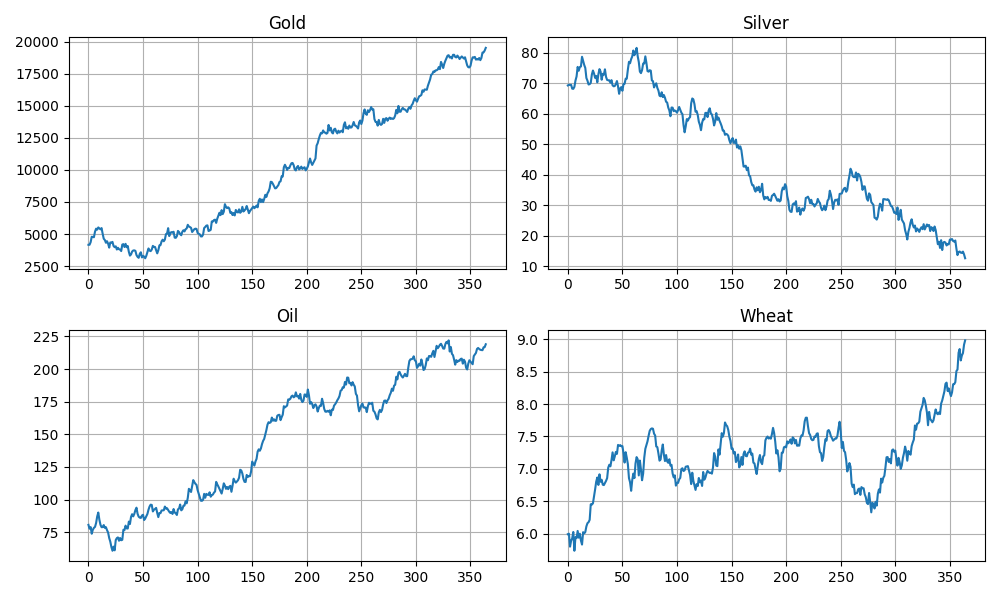

# Commodity Market Simulation Using NumPy


A simple Python project that simulates the price movement of selected commodities over a one-year period using random market fluctuations and basic economic events.

This project was built to practice working with **NumPy arrays**, **simulation modeling**, **data analysis**, and **Matplotlib visualizations** while exploring how external events can influence commodity prices.

---

## Overview

The simulation tracks four commodities:

* Gold
* Silver
* Oil
* Wheat

Prices change daily based on:

1. Random market fluctuations
2. Inflation events
3. Recession events
4. War events

At the end of the simulation, the program:

* Calculates percentage growth for each commodity
* Displays final performance statistics
* Visualizes price trends using Matplotlib charts

---

## Features

### Daily Market Movement

Each commodity experiences random daily returns generated from a normal distribution:

* Mean daily return: **0.1%**
* Volatility: **2%**

This creates realistic-looking price variations over time.

### Economic Event Simulation

Random economic events may occur during the simulation:

| Event     | Effect                                 |
| --------- | -------------------------------------- |
| Inflation | Increases Gold and Oil prices          |
| Recession | Reduces Silver and Oil prices          |
| War       | Strongly increases Gold and Oil prices |

These events introduce sudden market shocks and demonstrate how external factors can influence asset performance.

### Performance Analysis

After 365 simulated days, the program calculates:

* Initial price
* Final price
* Total percentage growth

for each commodity.

### Visualization

The project generates individual charts showing the price history of:

* Gold
* Silver
* Oil
* Wheat

This makes it easier to observe long-term trends and event-driven changes.

---

## Technologies Used

* Python
* NumPy
* Matplotlib

---

## Project Structure

```text
commodity_market_simulation.py

├── Commodity initialization
├── Economic event functions
│   ├── inflation()
│   ├── recession()
│   └── war()
├── Daily simulation loop
├── Growth calculation
├── Results summary
└── Visualization
```

---

## Installation

1. Clone the repository:

```bash
git clone https://github.com/your-username/commodity-market-simulation.git
```

2. Navigate to the project directory:

```bash
cd commodity-market-simulation
```

3. Install dependencies:

```bash
pip install numpy matplotlib
```

---

## Usage

Run the simulation:

```bash
python commodity_market_simulation.py
```

The program will:

1. Simulate 365 trading days
2. Apply random market movements
3. Trigger occasional economic events
4. Display performance results
5. Generate visualization charts

---

## Example Output

```text
Day 42: Inflation Crisis
Day 97: Recession Crisis
Day 214: War Crisis

Gold: $4500.00 -> $5231.42 (16.25%)
Silver: $76.00 -> $81.67 (7.46%)
Oil: $96.00 -> $118.50 (23.44%)
Wheat: $6.00 -> $6.42 (7.00%)
```

**Note:** Results vary on every execution because the simulation uses random values.

---

## Learning Objectives

This project demonstrates:

* NumPy array manipulation
* Random number generation
* Basic simulation modeling
* Event-driven market changes
* Data visualization with Matplotlib
* Financial data analysis fundamentals

---

## Limitations

This project is designed for educational and learning purposes.

The simulation simplifies real-world commodity markets by:

* Using fixed event probabilities
* Applying predefined event impacts
* Ignoring supply and demand dynamics
* Excluding historical market data
* Treating asset behavior independently

Real commodity markets are influenced by many additional factors such as geopolitical developments, weather conditions, production levels, monetary policy, and investor sentiment.

---

## Future Improvements

Potential enhancements include:

* Historical commodity price integration
* Asset correlation modeling
* Dynamic event severity levels
* Supply and demand simulation
* Monte Carlo forecasting
* Portfolio risk analysis
* Interactive dashboards
* Advanced statistical metrics

---

## Disclaimer

This project is a learning exercise focused on Python, NumPy, and Matplotlib. The generated results are simulated and should not be interpreted as financial advice or used for investment decisions.

---

## Author

**Banty Kumar**

Built as a practice project to strengthen understanding of simulation modeling, NumPy-based data analysis, and financial market visualization in Python.

